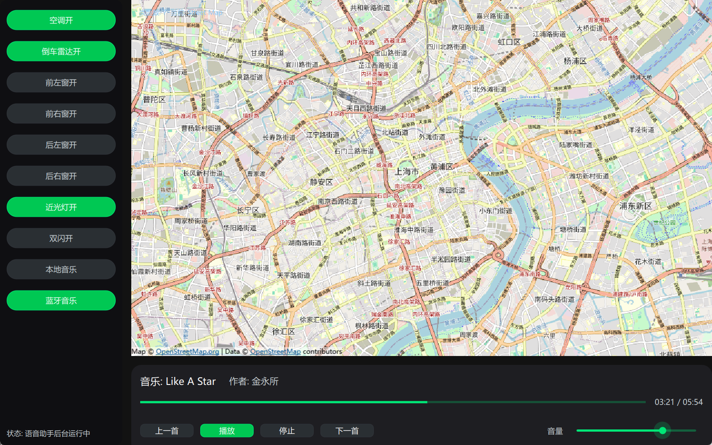

# Vehicle Central Control System

An offline-first in-vehicle voice assistant and multimedia control system built with Qt 5.15, integrating wake word detection, ASR/TTS, music playback, camera preview, and CAN-bus vehicle control. Designed for embedded Linux boards (e.g., RK3568).


## Features
- Wake word and command recording in a unified ALSA audio thread
- Offline ASR (Vosk) and TTS (Piper), minimal network dependency
- Music playback with auto pause/resume during voice replies
- Vehicle control and telemetry via SocketCAN (windows, lights, AC)
- Rear radar overlay and camera preview (V4L2)
- Cloud IoT hooks for telemetry, remote control, and sentinel monitoring
- Optional Bluetooth A2DP control (AVRCP) via BlueZ + DBus

## Modules
- `SpeechController`: state machine from wake → listen → ASR → action → TTS
- `PocketSphinxWakeDetector`: keyword spotting + VAD endpointing
- `MusicController`: local playback, source switch (Local/Bluetooth)
- `VehicleController`: CAN-bus parsing and control methods
- `VideoCapture`: V4L2 capture and YUYV → RGB conversion
- `BluetoothController/Dialog`: device scan, connect, AVRCP control, metadata
- `CloudIoTClient`: telemetry/events publishing, remote command handling
- `SentinelH264Streamer`: H.264 short segments (MP4) encoder in memory

## Build
Requires Qt 5.15 (Widgets, Multimedia, Network, SerialBus, DBus, Bluetooth) and FFmpeg libs:
```
qmake AI_yuyin.pro
make -j
```


